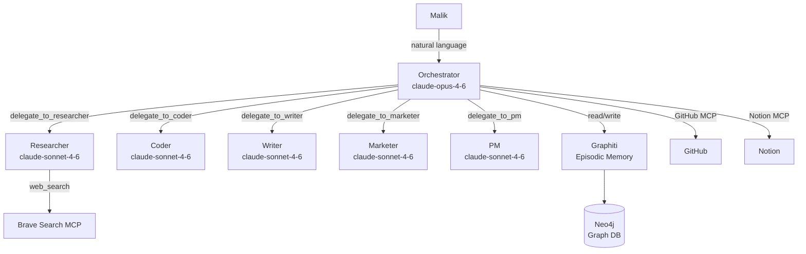
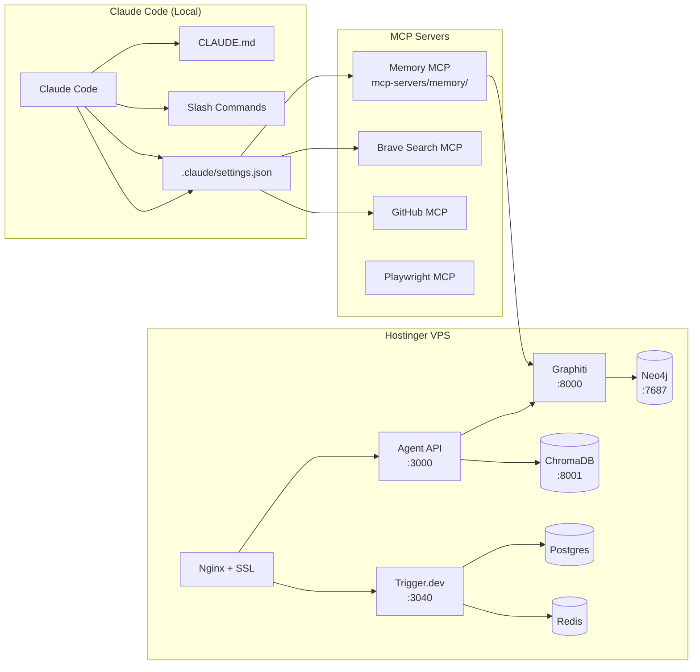

# Product Requirements Document (PRD)
## Agentic Engineering Workspace — BuilderBee / Centaurion.me / AOB

**Linked CRD:** [docs/CRD.md](./CRD.md)
**Current version:** 1.0
**Document owner:** Malik

---

## Version History

| Version | Date | Author | Summary of Changes | KPI Impact |
|---------|------|--------|-------------------|------------|
| [1.0](#version-10--foundation) | 2026-02-22 | Malik / Claude | Initial system implementation — orchestrator + 5 sub-agents + memory + MCP + workflows + VPS infra | Baseline established |

> **Versioning rule:** Any change to a CRD functional or non-functional requirement creates a new PRD version.
> Each version must document: what changed, why, and how it shifts project KPIs.
> Older versions remain in this file under their anchored headings.

---

## KPI Dashboard (Current: v1.0)

| KPI | Metric | v1.0 Baseline | Target |
|-----|--------|--------------|--------|
| **Memory recall rate** | % of relevant prior context surfaced on first search | TBD (measure after 30 days) | ≥80% |
| **Task delegation success** | % of delegations returning structured, usable output | TBD | ≥90% |
| **Time-to-standup** | Minutes to generate daily standup via `/standup` | TBD | <2 min |
| **Ad pipeline throughput** | Angles generated per `/programmatic-ad` run | 20 (spec) | ≥20, <5 min |
| **Content quality score** | Malik's manual rating per session (1-5) | TBD | ≥4.0 |
| **System uptime** | Agent API uptime | TBD | ≥99% |
| **Context loss incidents** | Sessions where memory was unavailable or stale | TBD | 0 |
| **Token cost / session** | Avg Anthropic API spend per orchestrator session | TBD | <$0.50 |

> KPI baselines marked TBD are measured after first 30 days of production use.

---

---

## Version 1.0 — Foundation

**Date:** 2026-02-22
**Status:** Implemented
**CRD requirements addressed:** FR-01 through FR-07, NFR-01 through NFR-06

### 1.0.1 Product Overview

A self-hosted, multi-agent AI system that acts as Malik's exo-cortex across three business domains. The system follows a city metaphor: an orchestrator (city dispatcher) routes natural language requests to specialist sub-agents (citizens), who use MCP servers (highways) to access tools and capabilities, with long-term memory (city hall) persisting institutional knowledge across sessions.



### 1.0.2 Features

#### F-01: Orchestrator (agents/orchestrator/)
- **What it does:** Central dispatcher. Reads memory, routes tasks, synthesizes results, writes memory.
- **Model:** claude-opus-4-6 (highest capability for routing decisions)
- **Tools exposed:** 5 delegation tools + write_memory
- **Output:** Final text response to Malik
- **CRD links:** FR-01, FR-02

#### F-02: Researcher Sub-Agent (agents/researcher/)
- **What it does:** Deep web research → structured intelligence brief
- **Input:** `{ query, depth, format, context }`
- **Output:** `{ summary, key_findings, sources, confidence, recommended_next_steps }`
- **CRD links:** FR-01, FR-02

#### F-03: Coder Sub-Agent (agents/coder/)
- **What it does:** Code generation, review, architecture design
- **Input:** `{ task, language, output_type, context }`
- **Output types:** snippet | file | review | architecture
- **CRD links:** FR-05

#### F-04: Writer Sub-Agent (agents/writer/)
- **What it does:** Content creation across formats
- **Input:** `{ task, format, tone, audience, context, word_count }`
- **Output:** `{ format, title, content, word_count, seo_keywords, meta_description }`
- **CRD links:** FR-02

#### F-05: Marketer Sub-Agent (agents/marketer/)
- **What it does:** Programmatic ad pipelines, campaign briefs, growth strategies
- **Input:** `{ task, niche, platform, budget_tier, context }`
- **Output:** Campaign JSON with themes, angles, platform fit, KPI targets
- **CRD links:** FR-03

#### F-06: PM Sub-Agent (agents/pm/)
- **What it does:** Standups, prioritization matrices, project status
- **Input:** `{ task, project, context }`
- **Output:** Standup JSON or Eisenhower priority matrix
- **CRD links:** FR-04

#### F-07: Memory Layer (tools/memory.js + mcp-servers/memory/)
- **What it does:** Read/write to Graphiti (episodic graph memory)
- **Write:** `writeMemory({ key, content, entity })` → Graphiti episode
- **Read:** `readMemory({ query, limit })` → ranked results
- **Exposed via:** Custom MCP server (memory_write, memory_search tools)
- **CRD links:** FR-01, NFR-01

#### F-08: Claude Code Slash Commands (.claude/commands/)
- `/research <topic>` — activates Research Agent protocol
- `/standup` — generates multi-domain daily standup
- `/programmatic-ad <niche>` — runs Cody Schneider pipeline
- `/project-brief <name>` — generates structured project brief
- **CRD links:** FR-03, FR-04, FR-06

#### F-09: Trigger.dev Workflows (workflows/)
- `marketing-pipeline.ts` — durable 3-phase pipeline: research → content → memory
- `coding-sprint.ts` — durable 3-phase sprint: architecture → implement → review
- `pm-daily-standup.ts` — cron-scheduled standup (Mon–Fri 08:00 UTC)
- **CRD links:** FR-07

#### F-10: HTTP API Server (agents/api/server.js)
- `GET /health` — liveness probe (unauthenticated)
- `POST /orchestrate` — run orchestrator (X-Api-Key required)
- `POST /agent/:name` — run specific sub-agent (X-Api-Key required)
- **CRD links:** NFR-03, NFR-05

#### F-11: VPS Infrastructure (docker-compose.prod.yml + scripts/)
- Neo4j 5.15 — graph database (Graphiti backend)
- ChromaDB — vector search
- Graphiti — episodic memory service
- Postgres 16 — Trigger.dev state
- Redis 7 — queues and caching
- Trigger.dev — workflow orchestration UI + runner
- Nginx — reverse proxy, SSL termination
- **CRD links:** NFR-01, NFR-02

### 1.0.3 Technical Architecture



### 1.0.4 File Map

```
agents/
  orchestrator/index.js          ← Main agentic loop + tool routing
  orchestrator/system-prompt.js  ← Memory-injected system prompt builder
  researcher/index.js            ← Research specialist
  coder/index.js                 ← Engineering specialist
  writer/index.js                ← Content specialist
  marketer/index.js              ← Marketing specialist
  pm/index.js                    ← PM specialist
  api/server.js                  ← HTTP API wrapping orchestrator
  */CLAUDE.md                    ← Each agent's constitution / contract
tools/memory.js                  ← Graphiti read/write interface
mcp-servers/memory/index.js      ← MCP server exposing memory to Claude Code
.claude/settings.json            ← MCP server config for Claude Code
.claude/commands/                ← Slash commands
workflows/
  marketing-pipeline.ts          ← Durable ad content pipeline
  coding-sprint.ts               ← Durable coding sprint
  pm-daily-standup.ts            ← Scheduled standup + cron
docker-compose.yml               ← Local dev
docker-compose.prod.yml          ← Production VPS
Dockerfile                       ← Agent API container
nginx/agent-system.conf          ← Reverse proxy config
scripts/
  provision-vps.sh               ← One-time VPS bootstrap
  deploy.sh                      ← rsync + rolling restart
  backup.sh                      ← Neo4j + Postgres backup
tsconfig.json                    ← TypeScript config for workflows
trigger.config.ts                ← Trigger.dev project config
```

### 1.0.5 Open Risks (v1.0)

| ID | Risk | Likelihood | Impact | Mitigation |
|----|------|-----------|--------|-----------|
| R-01 | Graphiti API changes break memory layer | Low | High | Pin Docker image version; abstract behind tools/memory.js |
| R-02 | Context window fills before memory is read | Medium | Medium | Memory search limited to 10 results; orchestrator reads before each loop |
| R-03 | Sub-agent output quality degrades without Malik review | Medium | High | AC-02 tests; memory stores previous outputs for comparison |
| R-04 | VPS downtime loses workflow state | Low | Medium | Trigger.dev state in Postgres; Postgres backed by volume |
| R-05 | Token costs exceed budget at scale | Medium | Medium | Monitor via logs; add token budget parameters to tools |
| R-06 | Trigger.dev self-hosted version lag vs cloud | Low | Low | Pinned image version; upgrade on schedule |

### 1.0.6 Deployment Checklist

Phase 1 — VPS Foundation:
- [ ] `bash scripts/provision-vps.sh` on fresh VPS
- [ ] Copy `.env` to VPS `/opt/agent-system/.env`
- [ ] `bash scripts/deploy.sh` — first deploy
- [ ] `certbot --nginx -d yourdomain.com -d trigger.yourdomain.com -d api.yourdomain.com`
- [ ] Verify `GET https://api.yourdomain.com/health` returns 200

Phase 2 — Memory Layer:
- [ ] Neo4j + Graphiti healthy: `docker compose -f docker-compose.prod.yml ps`
- [ ] Memory write test: `POST /agent/pm { "task": "standup", "project": "all" }`
- [ ] Memory search test: `/research "test query"` inside Claude Code

Phase 3 — Workflows:
- [ ] Trigger.dev UI accessible at `trigger.yourdomain.com`
- [ ] Deploy workflows: `npx trigger.dev@latest deploy`
- [ ] Trigger marketing pipeline: `POST /api/trigger` with test niche
- [ ] Verify cron: confirm pm-daily-standup runs at 08:00 UTC on Monday

Phase 4 — Hardening:
- [ ] `scripts/backup.sh` added to cron: `0 2 * * * /opt/agent-system/scripts/backup.sh`
- [ ] Uptime monitoring configured (Uptime Kuma or similar)
- [ ] Confirm no secrets in `git log --all` history

---

---

## Version Template (for future versions)

When a new version is needed, copy this block and fill it in:

```markdown
## Version X.Y — [Short Title]

**Date:** YYYY-MM-DD
**Status:** Proposed | In Development | Implemented | Deprecated
**Triggered by:** CRD change [FR-XX] | Operational finding | Malik decision
**Previous version:** [X.Y-1](#version-xy-1--short-title)

### What Changed
[Describe the change precisely]

### Why
[The CRD requirement or operational finding that drove this]

### KPI Impact Analysis

| KPI | Before (vX.Y-1) | Expected After (vX.Y) | Rationale |
|-----|----------------|----------------------|-----------|
| [KPI name] | [value] | [value] | [why it moves] |
| [KPI name] | [value] | [value] | [why it moves] |

### New/Modified Features
- F-XX: [Feature name] — [what changed]

### Breaking Changes
- [List any interface changes that affect other components]

### Migration Steps
1. [Step]
2. [Step]

### Rollback Plan
[How to revert to the previous version if needed]
```

---

*PRD maintained by Malik. New versions are created when CRD requirements change.*
*The KPI Dashboard table at the top is updated with each version.*
