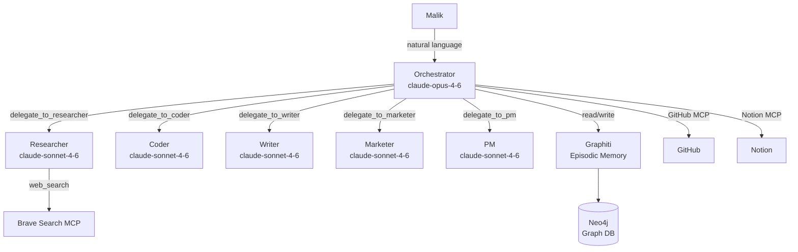
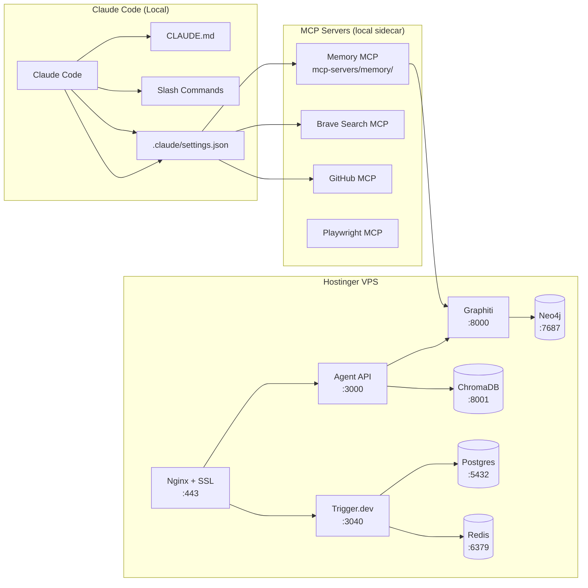

# Persistent Requirement Document (PRD)
## Agentic Engineering Workspace — BuilderBee / Centaurion.me / AOB

> **PRD = Persistent Requirement Document.**
> This document captures *how* the system delivers on the CRD's requirements,
> and evolves alongside the system as those requirements change.
>
> **Git history IS the version log.** There is no embedded version table.
> Each meaningful change to this document is a commit with a structured message.
> GitHub PRs document the "why" and link back to the CRD requirement that triggered the change.
>
> The frontmatter `version` field is a semantic version tag. On every substantive change:
> 1. Update `version` and `date` in frontmatter
> 2. Add a commit message: `prd(v1.x.y): <what changed and why>`
> 3. Tag the commit: `git tag prd-v1.x.y`

**Linked CRD:** [docs/CRD.md](./CRD.md)
**Current version:** `1.0.0` — see `git log docs/PRD.mdx` for full history

---

## Versioning Model

| Version segment | Increment when… |
|-----------------|-----------------|
| **MAJOR** (1.x.x) | A new CRD functional requirement is added — the system's scope expands |
| **MINOR** (x.1.x) | An existing CRD requirement changes, or a significant feature is replaced/reworked |
| **PATCH** (x.x.1) | Bug fix, infrastructure hardening, documentation clarification, cost optimization |

Commit message format for PRD changes:
```
prd(v1.x.y): <imperative summary>

CRD trigger: <FR-XX or NFR-XX, or "operational finding">
What changed: <precise description>
Implications:
  - Cost: <delta, if any>
  - Time: <estimated effort>
  - Features: <added / modified / removed>
  - Risk: <new or resolved risks>
```

---

## KPI Dashboard — v1.0.0

| KPI | Metric | v1.0.0 Baseline | Target |
|-----|--------|----------------|--------|
| **Memory recall rate** | % relevant prior context surfaced on first search | TBD (measure after 30 days) | ≥80% |
| **Task delegation success** | % delegations returning structured, usable output | TBD | ≥90% |
| **Time-to-standup** | Minutes to generate daily standup via `/standup` | TBD | <2 min |
| **Ad pipeline throughput** | Angles generated per `/programmatic-ad` run | 20 (spec) | ≥20, <5 min |
| **Content quality score** | Malik's manual rating per session (1–5) | TBD | ≥4.0 |
| **System uptime** | Agent API uptime on VPS | TBD | ≥99% |
| **Context loss incidents** | Sessions where memory was unavailable or stale | TBD | 0 |
| **Token cost / session** | Avg Anthropic API spend per orchestrator session | TBD | <$0.50 |

> Baselines marked TBD are set after first 30 days of production use.
> Update this table in the same commit that updates the `version` frontmatter field.

---

## Requirement → Implementation Matrix

Maps every CRD requirement to its concrete implementation. Updated with each PRD version.

| CRD Req | Description | Implementation | File(s) | v1.0.0 Status |
|---------|-------------|---------------|---------|--------------|
| FR-01 | Persistent cross-session memory | Graphiti episodic graph + MCP memory server | `tools/memory.js`, `mcp-servers/memory/index.js` | ✅ Implemented |
| FR-02 | Multi-domain task delegation | Orchestrator agentic loop + 5 sub-agents | `agents/orchestrator/`, `agents/*/` | ✅ Implemented |
| FR-03 | Programmatic content pipeline | Marketer sub-agent + `/programmatic-ad` command + durable workflow | `agents/marketer/`, `workflows/marketing-pipeline.ts` | ✅ Implemented |
| FR-04 | Daily operational awareness | PM sub-agent + `/standup` command + cron workflow | `agents/pm/`, `workflows/pm-daily-standup.ts` | ✅ Implemented |
| FR-05 | Code generation & review | Coder sub-agent + `/project-brief` command | `agents/coder/` | ✅ Implemented |
| FR-06 | Project brief generation | `/project-brief` slash command | `.claude/commands/project-brief.md` | ✅ Implemented |
| FR-07 | Workflow durability | Trigger.dev durable workflows | `workflows/`, `trigger.config.ts` | ✅ Implemented |
| NFR-01 | Data sovereignty | Self-hosted Neo4j + ChromaDB + Graphiti on Hostinger VPS | `docker-compose.prod.yml` | ✅ Implemented |
| NFR-02 | Vendor portability | Models configurable via env vars; Docker Compose infra | `.env.example`, `docker-compose.prod.yml` | ✅ Implemented |
| NFR-03 | Security baseline | Agent API key auth; secrets in env only; HTTPS via nginx + certbot | `agents/api/server.js`, `nginx/agent-system.conf` | ✅ Implemented |
| NFR-04 | Modularity | Each sub-agent independently runnable; CLI entry points in each | `agents/*/index.js` | ✅ Implemented |
| NFR-05 | Observability | Delegation logs with agent + tokens; `/health` endpoint; Trigger.dev UI | `agents/orchestrator/index.js`, `agents/api/server.js` | ✅ Implemented |
| NFR-06 | Response quality | Opus for orchestration, Sonnet for sub-tasks; documented in system prompts | `agents/orchestrator/index.js` | ✅ Implemented |

---

## System Architecture — v1.0.0

### Agent Topology



### Infrastructure Topology



---

## Feature Specifications — v1.0.0

### F-01: Orchestrator
- **File:** `agents/orchestrator/index.js`
- **Model:** `claude-opus-4-6`
- **Loop:** Agentic loop capped at 20 turns (`MAX_LOOP_TURNS`)
- **Memory:** Reads on startup with 5s timeout (`MEMORY_TIMEOUT_MS`); writes via `write_memory` tool
- **Tools:** 5 delegation tools + `write_memory`
- **Output:** Structured text response; throws (never returns `undefined`) on unexpected stop
- **CRD:** FR-01, FR-02

### F-02: Researcher Sub-Agent
- **File:** `agents/researcher/index.js`
- **Model:** `claude-sonnet-4-6`
- **Input:** `{ query, depth, format, context }`
- **Output contract:** `{ query, summary, key_findings[], sources[], confidence, contradictions[], recommended_next_steps[] }`
- **Fallback:** Returns contract-compliant schema with `_parse_error: true` if JSON parse fails
- **CRD:** FR-01, FR-02

### F-03: Coder Sub-Agent
- **File:** `agents/coder/index.js`
- **Model:** `claude-sonnet-4-6`
- **Input:** `{ task, language, output_type, context }`
- **Output contract:** `{ output_type, content, tokens_used }`
- **CRD:** FR-05

### F-04: Writer Sub-Agent
- **File:** `agents/writer/index.js`
- **Model:** `claude-sonnet-4-6`
- **Input:** `{ task, format, tone, audience, context, word_count }`
- **Output contract:** `{ format, title, content, word_count, seo_keywords[], meta_description }`
- **Fallback:** Returns contract-compliant schema with raw text in `content`
- **CRD:** FR-02

### F-05: Marketer Sub-Agent
- **File:** `agents/marketer/index.js`
- **Model:** `claude-sonnet-4-6`
- **Input:** `{ task, niche, platform, budget_tier, context }`
- **Output contract:** Campaign JSON with `campaign_themes[]`
- **Fallback:** Returns `{ niche, platform, budget_tier, campaign_themes: [], _parse_error: true, _raw }`
- **CRD:** FR-03

### F-06: PM Sub-Agent
- **File:** `agents/pm/index.js`
- **Model:** `claude-sonnet-4-6`
- **Input:** `{ task, project, context }`
- **Output contract (standup):** `{ date, projects: { builderbee, centaurion, aob }, decisions_needed[], overdue_items[] }`
- **Fallback:** Returns contract-compliant standup skeleton with `_parse_error: true`
- **CRD:** FR-04

### F-07: Memory Layer
- **Files:** `tools/memory.js`, `mcp-servers/memory/index.js`
- **Backend:** Graphiti → Neo4j
- **Write:** `writeMemory({ key, content, entity })` — stores episode with timestamp + key
- **Read:** `readMemory({ query, limit })` — semantic search over episodes
- **MCP tools:** `memory_write`, `memory_search`
- **Crash safety:** MCP server now has SIGTERM/SIGINT handlers and `unhandledRejection` surface
- **CRD:** FR-01, NFR-01

### F-08: Slash Commands
- **Location:** `.claude/commands/`
- `/research <topic>` — research agent protocol
- `/standup` — multi-domain standup
- `/programmatic-ad <niche>` — Cody Schneider pipeline (20 angles → 5 themes)
- `/project-brief <name>` — structured brief
- **CRD:** FR-03, FR-04, FR-06

### F-09: Trigger.dev Workflows
- **Files:** `workflows/`
- `marketing-pipeline.ts` — durable 3-phase pipeline: research → content → memory
- `coding-sprint.ts` — durable 3-phase sprint: architecture → implement → review
- `pm-daily-standup.ts` — cron: Mon–Fri 08:00 UTC
- **Build:** `tsconfig.json` + `trigger.config.ts` required (both present)
- **Deploy:** `npx trigger.dev@latest deploy`
- **CRD:** FR-07

### F-10: HTTP API
- **File:** `agents/api/server.js`
- `GET /health` — unauthenticated liveness probe
- `POST /orchestrate` — run orchestrator (requires `X-Api-Key`)
- `POST /agent/:name` — run named sub-agent directly (requires `X-Api-Key`)
- **Auth:** Constant-time key comparison via `crypto.timingSafeEqual`
- **CRD:** NFR-03, NFR-05

### F-11: VPS Infrastructure
- **Files:** `docker-compose.prod.yml`, `nginx/agent-system.conf`, `scripts/`
- Neo4j 5.15, ChromaDB, Graphiti, Postgres 16, Redis 7, Trigger.dev, Nginx
- **Provision:** `scripts/provision-vps.sh` (one-time VPS bootstrap)
- **Deploy:** `scripts/deploy.sh` (rsync + rolling restart)
- **Backup:** `scripts/backup.sh` (Neo4j + Postgres)
- **CRD:** NFR-01, NFR-02

---

## Cost & Time Implications — v1.0.0

### Operational Costs (monthly estimates at light usage)

| Cost item | Estimate | Basis |
|-----------|----------|-------|
| Anthropic API — orchestrator | $15–40/mo | claude-opus-4-6 at ~50 sessions/day, 8k tokens avg |
| Anthropic API — sub-agents | $5–15/mo | claude-sonnet-4-6, shorter context |
| Hostinger VPS (8 GB RAM, 4 vCPU) | $15–25/mo | Enough for Neo4j + Redis + all services |
| Trigger.dev self-hosted | $0 | Self-hosted; compute included in VPS |
| Brave Search API | $0–5/mo | Free tier: 2,000 calls/mo |
| **Total** | **$35–85/mo** | At current usage assumptions |

> Token costs scale with number of orchestrator sessions and sub-agent calls per session.
> The `<$0.50/session` KPI target assumes ≤3 sub-agent delegations per session.

### Effort to maintain (per change type)

| Change type | Estimated effort | Who |
|-------------|----------------|-----|
| Add a new sub-agent | 2–4 hours | Malik / Coder agent |
| Add a new Trigger.dev workflow | 1–2 hours | Malik / Coder agent |
| Update CRD requirement → new PRD minor version | 30–60 min (doc) + varies (impl) | Malik |
| VPS provisioning (one-time) | 2–4 hours | Malik + `provision-vps.sh` |
| Routine deploy | <5 min | `deploy.sh` |

---

## Open Risks — v1.0.0

| ID | Risk | Likelihood | Impact | Mitigation |
|----|------|-----------|--------|-----------|
| R-01 | Graphiti API changes break memory layer | Low | High | Pin Docker image; abstract behind `tools/memory.js` |
| R-02 | Context window fills before memory is read | Medium | Medium | Memory limited to 10 results; read before first loop turn |
| R-03 | Sub-agent output quality degrades without review | Medium | High | `_parse_error` flags in fallback; memory stores previous outputs |
| R-04 | VPS downtime loses workflow state | Low | Medium | Trigger.dev state in Postgres; Postgres on named Docker volume |
| R-05 | Token costs exceed budget at scale | Medium | Medium | Monitor via delegation logs; `MAX_LOOP_TURNS` cap |
| R-06 | Trigger.dev self-hosted version lag | Low | Low | Pinned image; upgrade on schedule |
| R-07 | `readMemory` timeout too short for cold start | Low | Low | `MEMORY_TIMEOUT_MS=5000`; can be raised via env var if needed |

---

## Acceptance Criteria — v1.0.0

| ID | Criterion | How to verify |
|----|-----------|---------------|
| AC-01 | Memory survives session restart | Write memory, kill Claude Code, restart, `/research` same topic |
| AC-02 | `/research <topic>` returns structured brief | Verify JSON with `summary`, `key_findings`, `sources` fields |
| AC-03 | `/standup` covers all three domains | Check BuilderBee + Centaurion + AOB sections present |
| AC-04 | `/programmatic-ad <niche>` produces ≥20 angles in valid JSON | Count `campaign_themes` entries |
| AC-05 | Sub-agents run independently | `node agents/researcher/index.js "test query"` returns valid output |
| AC-06 | Marketing pipeline workflow completes without error | Trigger workflow; verify success in Trigger.dev UI |
| AC-07 | `GET /health` returns 200 | `curl http://localhost:3000/health` |
| AC-08 | No secrets in git history | `git log -S "sk-ant" --all` returns empty |
| AC-09 | `docker compose up -d` starts all services | All containers reach `healthy` status |
| AC-10 | New sub-agent addable without modifying orchestrator | Add agent file + tool definition in `ORCHESTRATOR_TOOLS` only |

---

## Deployment Checklist — v1.0.0

### Phase 1 — VPS Foundation
- [ ] Run `bash scripts/provision-vps.sh` on fresh VPS
- [ ] Copy `.env` to VPS: `scp .env user@vps:/opt/agent-system/.env`
- [ ] Run first deploy: `bash scripts/deploy.sh`
- [ ] Issue SSL certs: `certbot --nginx -d api.YOURDOMAIN.com -d trigger.YOURDOMAIN.com`
- [ ] Verify: `curl https://api.YOURDOMAIN.com/health` → `{"status":"ok"}`

### Phase 2 — Memory Layer
- [ ] All services healthy: `docker compose -f docker-compose.prod.yml ps`
- [ ] Memory write: `POST /agent/pm { "task": "standup", "project": "all" }`
- [ ] Memory search: `/research "agent system"` inside Claude Code on local machine

### Phase 3 — Workflows
- [ ] Trigger.dev UI accessible: `https://trigger.YOURDOMAIN.com`
- [ ] Deploy workflows: `npx trigger.dev@latest deploy`
- [ ] Trigger marketing pipeline: `POST /api/trigger` with test niche
- [ ] Verify cron: `pm-daily-standup` runs at 08:00 UTC on Monday

### Phase 4 — Hardening
- [ ] Cron backup: `0 2 * * * /opt/agent-system/scripts/backup.sh`
- [ ] Uptime monitoring: add `https://api.YOURDOMAIN.com/health` to Uptime Kuma
- [ ] Secrets audit: `git log --all -S "sk-ant"` returns empty

---

## Change Log Template

When a change is committed, the commit body should follow this template.
The PRD file itself is updated only when a feature spec, risk, cost estimate, or KPI target changes:

```
prd(v1.x.y): <imperative summary of what changed>

CRD trigger: <FR-XX | NFR-XX | operational finding | Malik decision>
What changed: <precise description — what was before, what is after>
Implications:
  - Cost: <e.g., +$10/mo Anthropic API due to longer context>
  - Time: <e.g., 3h implementation, 1h testing>
  - Features: <added F-XX | modified F-XX | deprecated F-XX>
  - Risk: <new R-XX added | R-XX resolved>

KPI delta:
  - <KPI name>: <before> → <after> (reason)
```

---

*This document is maintained by Malik. Git history at `docs/PRD.mdx` is the version record.*
*CRD changes trigger a MINOR or MAJOR version increment here.*
*Infrastructure-only fixes increment PATCH only.*
